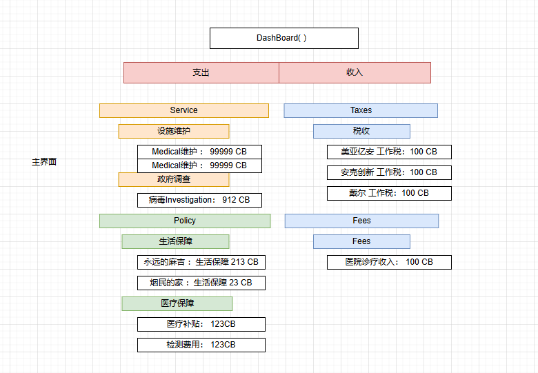
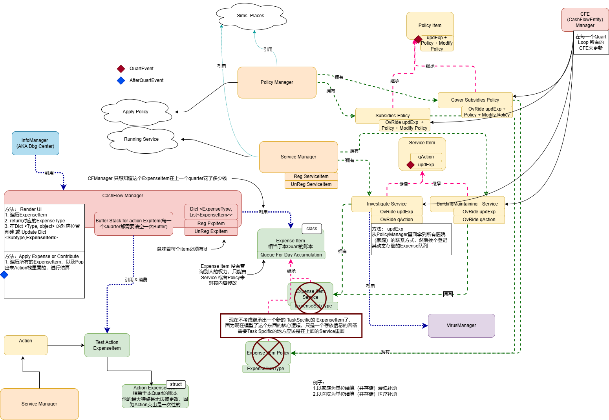

# CashFlowNetwork

大类将会被记录在 InfoCentre里面，小类将会被记录在Expense里面，需要靠统计的时候自动计算。

（以Expense举例）
大类的代码的语言: ExpenseType
小类的代码语言：ExpenseSubType
原子类代码语言: ExpenseInstance

下面是一个从UI视角观察的层级逻辑。参考上面的

下面是一个代码层面的层级逻辑
